# Explore display fixes

Before images are the supplied originals. After images use the live museum API at a 1280 × 900 viewport; counts may differ as the collection changes.

## Monet cards stay together across columns

Before

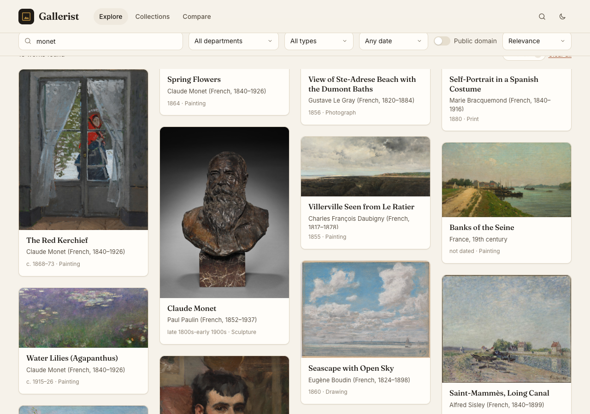

After

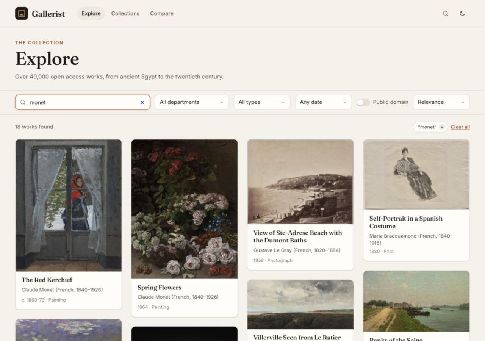

## Filter bar clears the fixed header

Before

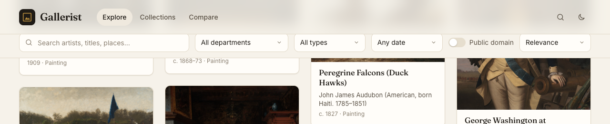

After

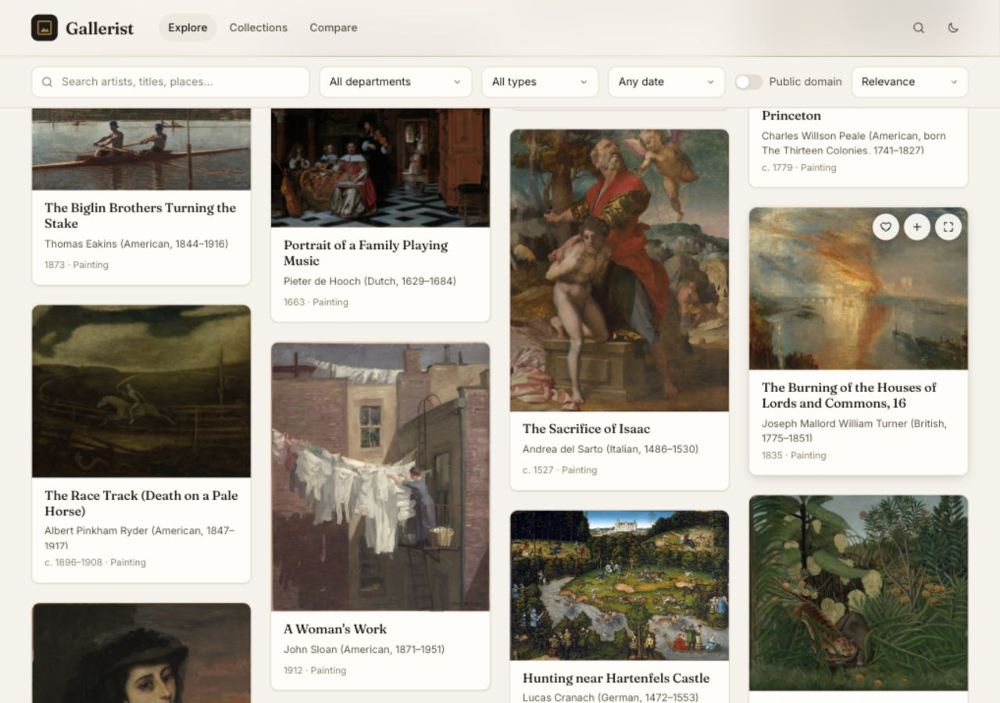

## Start handle cannot pass the end handle

Before

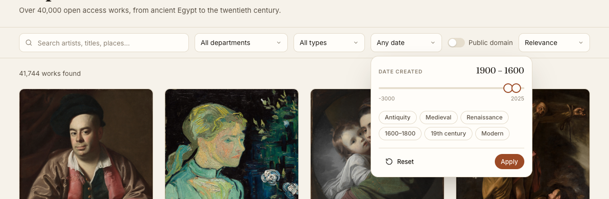

After

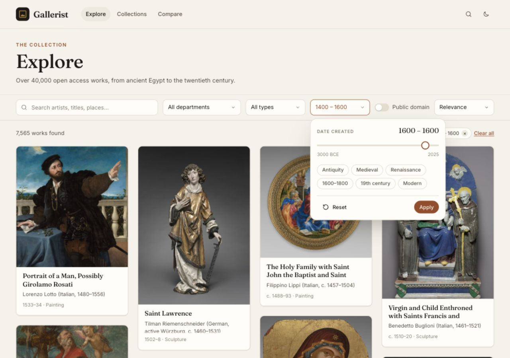

## Preset selection and BCE date labels

Before

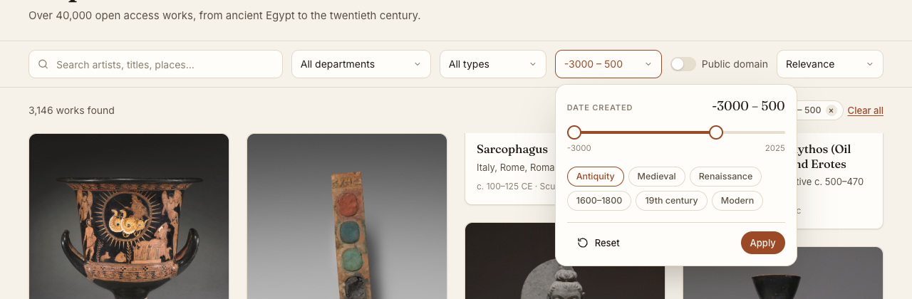

After

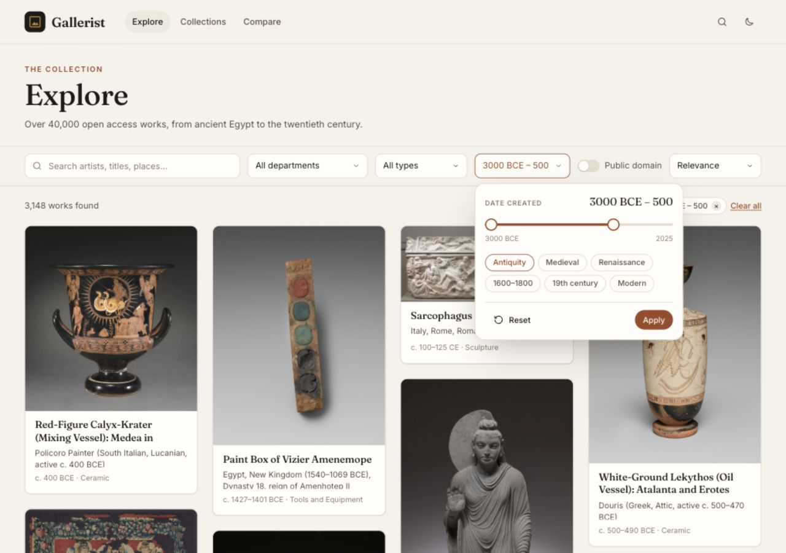

## Artist tooltip extends beyond the card without clipping

Before

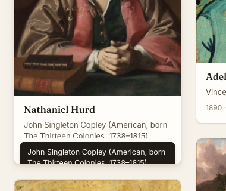

After

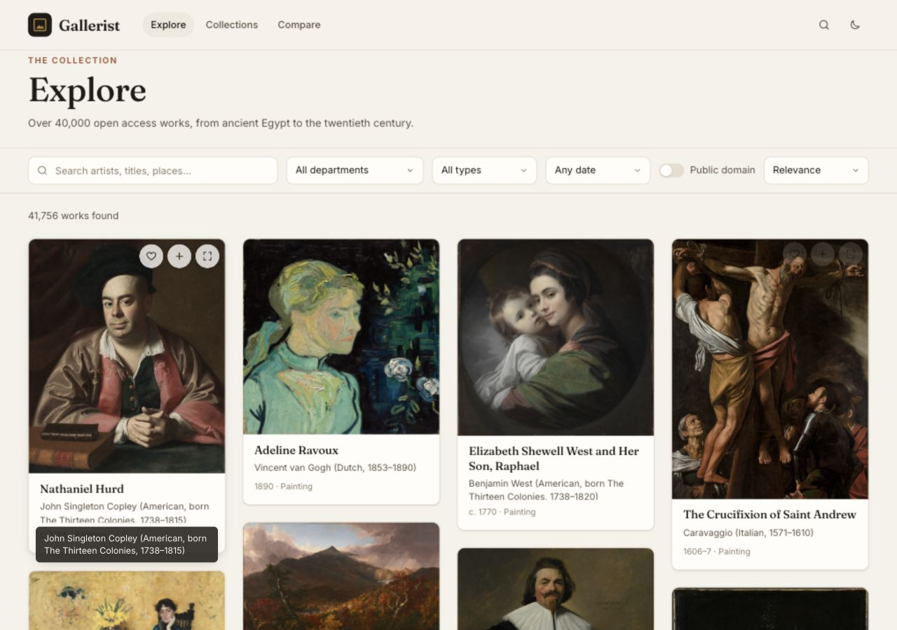

## Verification

- Monet: all rendered cards have one unbroken layout rectangle.
- Scrolled desktop: header bottom and filter top both measured 72px.
- Pointer drag of start past end clamps to 1600–1600. Keyboard end below start clamps to 1400–1400.
- Antiquity remains selected after moving the pointer away; label reads 3000 BCE–500.
- Artist tooltip is visible beyond the card body with overflow visible.
- At 393 × 852, page width is 393px and date panel stays within x=12–381px. Keyboard clamping also passes.
- Production build and git diff --check passed.

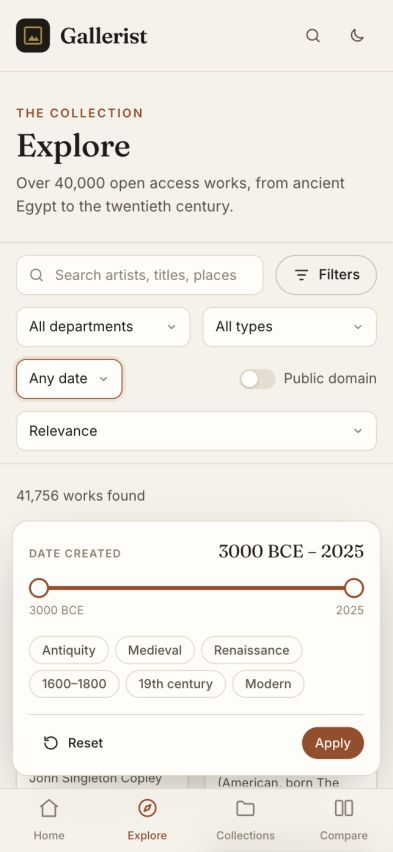
